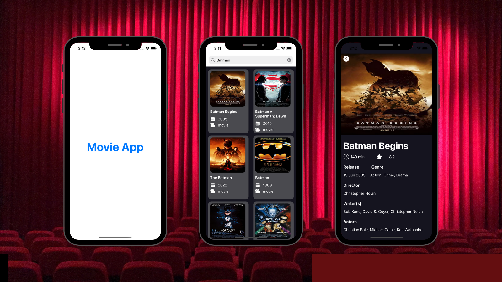

# MovieApp

- MovieApp is an application developed to view the movies you are looking for and the details about these movies.
- Developed with UIKit
- MVC was used as the architecture.
- The url session was used in the service layer.
- Images were displayed with URLSession and KFImage. The KFImage package was installed with SPM.
- Added Firebase to the project. Used remote config, analytics and cloud messaging. The Firebase package was installed with SPM.

## Uygulama Görüntüleri

